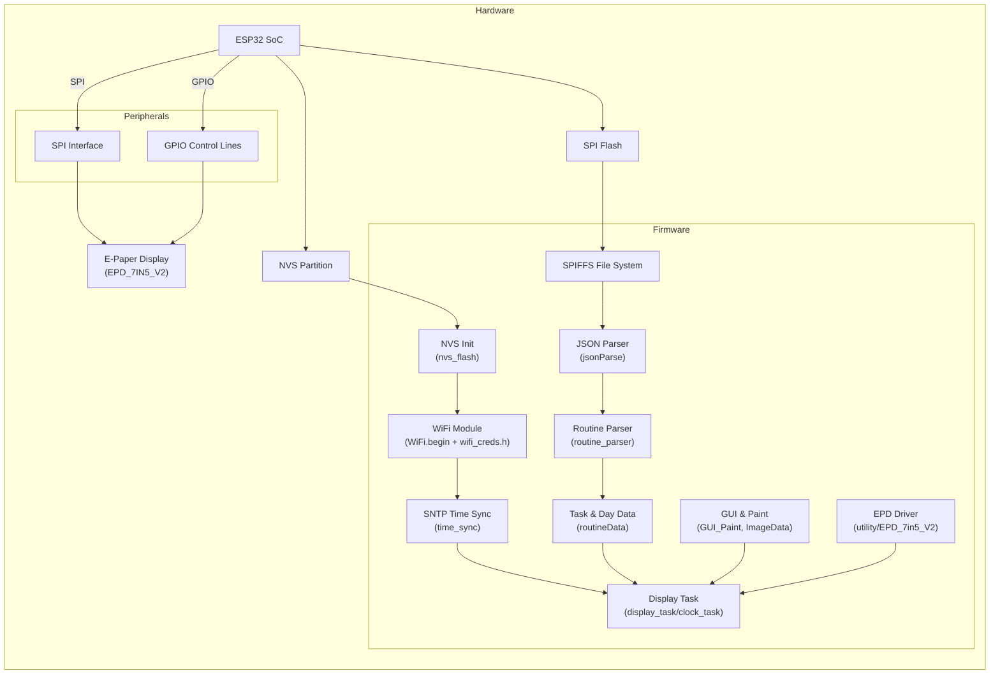

# Morning Person ESP32

Click to expand the Mermaid diagram

```mermaid
flowchart LR

  %% Hardware subgraph
  subgraph Hardware
    ESP32["ESP32 SoC"]
    NVS["NVS Partition"]
    EPD["E-Paper Display
    (EPD_7IN5_V2)"]
    FLASH["SPI Flash"]

    subgraph Firmware
    NVS_INIT["NVS Init
    (nvs_flash)"]
    FS["SPIFFS File System"]
    JSON["JSON Parser
    (jsonParse)"]
    ROUTINE["Routine Parser
    (routine_parser)"]
    DATA["Task & Day Data
    (routineData)"]
    WIFI["WiFi Module
    (WiFi.begin + wifi_creds.h)"]
    SNTP["SNTP Time Sync
    (time_sync)"]
    DISPLAY["Display Task
    (display_task/clock_task)"]
    GUI["GUI & Paint
    (GUI_Paint, ImageData)"]
    EPD_DRV["EPD Driver
    (utility/EPD_7in5_V2)"]
  end

    subgraph Peripherals
      SPI_BUS["SPI Interface"]
      GPIO["GPIO Control Lines"]
    end
    
  end

  %% Draw your arrows
  ESP32 -->|SPI| SPI_BUS
  SPI_BUS --> EPD
  ESP32 --> FLASH
  FLASH --> FS
  ESP32 --> NVS

  %% NOW this arrow has a clear “line of sight” to NVS_INIT above it
  NVS --> NVS_INIT

  %% firmware flow
  NVS_INIT --> WIFI
  WIFI --> SNTP
  SNTP --> DISPLAY

  FS --> JSON
  JSON --> ROUTINE
  ROUTINE --> DATA
  DATA --> DISPLAY

  GUI --> DISPLAY
  EPD_DRV --> DISPLAY

  ESP32 -->|GPIO| GPIO
  GPIO --> EPD
```

