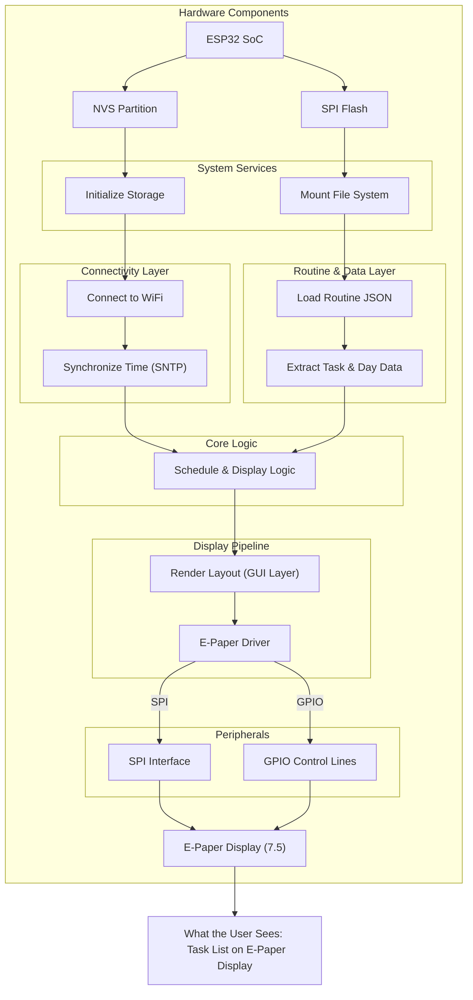
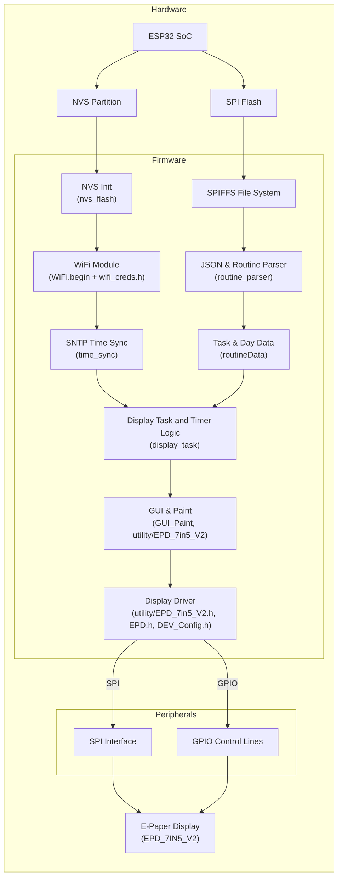

# Morning Person ESP32

## Abstracted Overview

```mermaid
flowchart TD
  %% === System Overview: Morning Person ESP32 ===

  %% Hardware Section
  subgraph "Hardware Components"
    ESP32["ESP32 SoC"]
    NVS["NVS Partition"]
    FLASH["SPI Flash"]
    EPD["E-Paper Display (7.5)"]


    %% Functional Firmware Layers
    subgraph "System Services"
        NVS_INIT["Initialize Storage"]
        FS["Mount File System"]
    end

    subgraph "Connectivity Layer"
        WIFI["Connect to WiFi"]
        SNTP["Synchronize Time (SNTP)"]
    end

    subgraph "Routine & Data Layer"
        ROUTINE["Load Routine JSON"]
        DATA["Extract Task & Day Data"]
    end

    subgraph "Core Logic"
        DISPLAY["Schedule & Display Logic"]
    end

    subgraph "Display Pipeline"
        GUI["Render Layout (GUI Layer)"]
        EPD_DRV["E-Paper Driver"]
    end

    subgraph "Peripherals"
        SPI_BUS["SPI Interface"]
        GPIO["GPIO Control Lines"]
    end
  end

  

  %% User Output
  USER_VIEW["What the User Sees: 
  Task List on E-Paper Display"]

  %% Connections
  ESP32 --> NVS --> NVS_INIT --> WIFI --> SNTP --> DISPLAY
  ESP32 --> FLASH --> FS --> ROUTINE --> DATA --> DISPLAY
  DISPLAY --> GUI --> EPD_DRV
  EPD_DRV -->|SPI| SPI_BUS --> EPD
  EPD_DRV -->|GPIO| GPIO --> EPD
  EPD --> USER_VIEW
```

## Detailed Overview

```mermaid
flowchart LR
  %% Hardware group
  subgraph Hardware
    ESP32["ESP32 SoC"]
    NVS["NVS Partition"]
    EPD["E-Paper Display
    (EPD_7IN5_V2)"]
    FLASH["SPI Flash"]

  subgraph Firmware
    NVS_INIT["NVS Init
    (nvs_flash)"]
    FS["SPIFFS File System"]
    ROUTINE["JSON & Routine Parser
    (routine_parser)"]
    DATA["Task & Day Data
    (routineData)"]
    WIFI["WiFi Module
    (WiFi.begin + wifi_creds.h)"]
    SNTP["SNTP Time Sync
    (time_sync)"]
    DISPLAY["Display Task and Timer Logic
    (display_task)"]
    GUI["GUI & Paint
    (GUI_Paint, utility/EPD_7in5_V2)"]
    EPD_DRV["Display Driver
    (utility/EPD_7in5_V2.h, EPD.h, DEV_Config.h)"]
  end

    subgraph Peripherals
      SPI_BUS["SPI Interface"]
      GPIO["GPIO Control Lines"]
    end
  end

  %% Firmware group (moved out to be a sibling of Hardware)


  %% Connections
  EPD_DRV -->|SPI| SPI_BUS
  SPI_BUS --> EPD
  ESP32 --> FLASH
  FLASH --> FS
  ESP32 --> NVS
  NVS --> NVS_INIT

  NVS_INIT --> WIFI
  WIFI --> SNTP
  SNTP --> DISPLAY

  FS --> ROUTINE
  ROUTINE --> DATA
  DATA --> DISPLAY

  DISPLAY --> GUI
  GUI --> EPD_DRV

  EPD_DRV -->|GPIO| GPIO
  GPIO --> EPD
```

